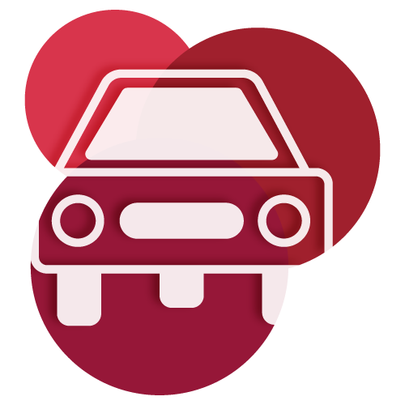

#  DiPi Car

DiPi Car is an API aimed at controlling a car built by the user. This supports video streaming between the server and the client (if the car is equipped with a camera module).

## Documentation

- REST API documentation: [english](/doc/API-doc-en.md) or [french](/doc/API-doc-fr.md)
- Installation: [english](/doc/installation-en.md) or [french](/doc/installation-fr.md)
- Configuration: [english](/doc/configuration-en.md) or [french](/doc/configuration-fr.md)
- CLI usage: [english](/doc/CLI-doc-en.md) or [french](/doc/CLI-doc-fr.md)
- Full guide (requirement, build, installation): [english](https://dipihub.netlify.app/en/#/docs/build) or [french](https://dipihub.netlify.app/fr/#/docs/build)

## Links

- The website of the project: [DiPi Hub](https://dipihub.netlify.app/en/#/)🏠
- Module of streaming : [PiStreamer](https://www.npmjs.com/package/pistreamer)🎥
- Official client: [DiPi Link](https://github.com/Iucapad/dipilink)🎮

